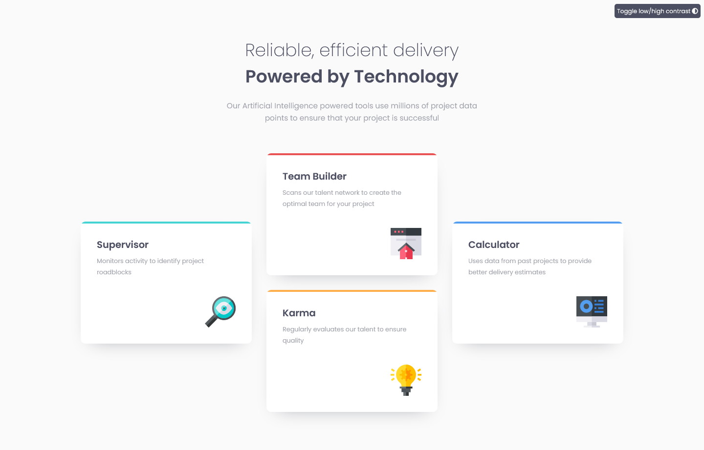

# Frontend Mentor - Four card feature section solution

This is a solution to the [Four card feature section challenge on Frontend Mentor](https://www.frontendmentor.io/challenges/four-card-feature-section-weK1eFYK). Frontend Mentor challenges help you improve your coding skills by building realistic projects. 

## Table of contents

- [Overview](#overview)
  - [The challenge](#the-challenge)
  - [Screenshot](#screenshot)
  - [Links](#links)
- [My process](#my-process)
  - [Built with](#built-with)
  - [What I learned](#what-i-learned)
  - [Continued development](#continued-development)
  - [Useful resources](#useful-resources)
- [Author](#author)

## Overview

### The challenge

Users should be able to:

- View the optimal layout for the site depending on their device's screen size

### Screenshot



### Links

- Solution URL: [Add solution URL here](https://your-solution-url.com)
- Live Site URL: [https://fananibanani.github.io/four-card-feature-section/](https://fananibanani.github.io/four-card-feature-section/)

## My process

### Built with

- Semantic HTML5 markup
- SCSS
- Sass variables
- CSS Grid
- Mobile-first workflow

### What I learned

- Learned how to use @import and partials in SCSS. Admittedly only tried this at the very end when my code was 95% done.
- Learned a lot more about CSS grid than what basic knowledge I had before. I'm especially proud of how I figured out to do the transition from one-column layout (mobile view) to two-by-two (tablet view) and then to the one-two-one layout (desktop view) as shown in the design.
  - I did this by first creating a 4-row column on mobile.
  - Then for tablet view the grid changes to a two-by-two layout, and the grid-auto-flow kicks in, making sure that the content flows horizontally.
  - And for desktop view the first and last cards span the height of 2 rows. Because of that the last card spills over the tablet grid layout, resulting in an implicitly-created column, so a whole new column and row setup was not needed for desktop view. The grid-auto-flow also changes to column so that the layout matches the design.
  - Here is how this looked in my code:
  
```scss
main {
  display: grid;
  grid-auto-flow: row;
  grid-template-columns: $card-width-s;
  grid-template-rows: repeat(4, $card-height-s);
  gap: 1.5rem;
  margin: 0 auto max(2rem, 4rem) auto;
  max-width: fit-content;
  place-items: center;

  @media screen and (min-width: $tablet) {
    grid-template-columns: repeat(2, $card-width-l);
    grid-template-rows: repeat(2, $card-height-l);
    grid-auto-columns: $card-width-l;
    gap: 2rem;
  }

  @media screen and (min-width: $desktop) {
    grid-auto-flow: column;
  }
}

.card {
  @media screen and (min-width: $desktop) {
    &:first-of-type,
    &:last-of-type {
      grid-row: span 2;
    }
  }
}
```

### Continued development

Use this section to outline areas that you want to continue focusing on in future projects. These could be concepts you're still not completely comfortable with or techniques you found useful that you want to refine and perfect.

**Note: Delete this note and the content within this section and replace with your own plans for continued development.**

### Useful resources

- [CSS-tricks: grid-auto-flow](https://css-tricks.com/almanac/properties/g/grid-auto-flow/) - This helped me to figure out the grid auto flow setting.
- [Sass At-Rules @import](https://sass-lang.com/documentation/at-rules/import) - This is what helped me understand the usage of @import for partials as I wasn't yet very familiar with it.

## Author

- Frontend Mentor - [@fananibanani](https://www.frontendmentor.io/profile/fananibanani)
